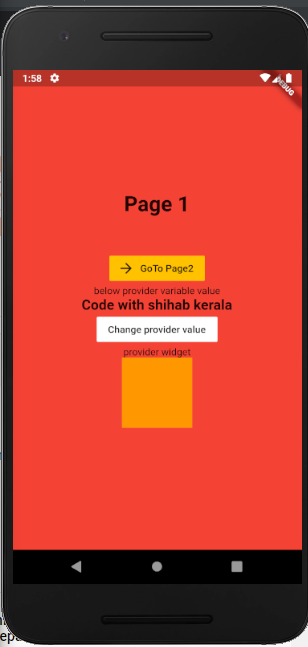
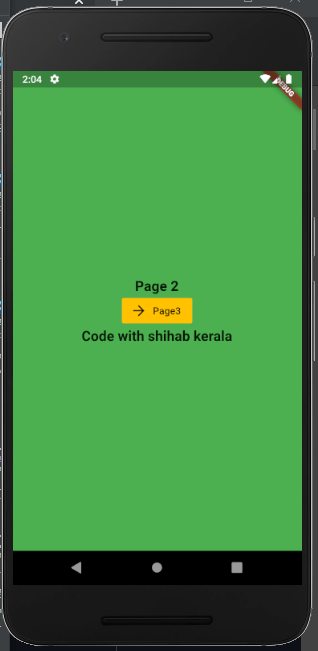
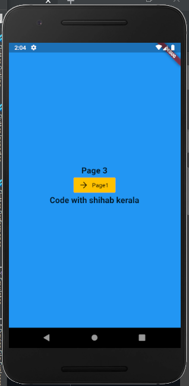
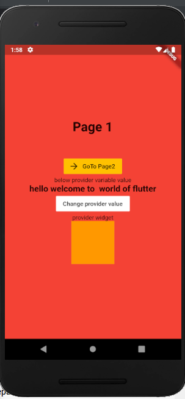
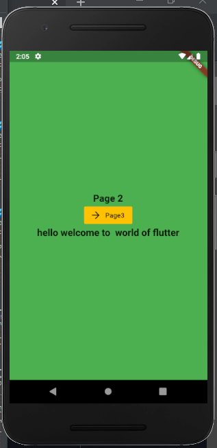

# statemanagementprovider

A new Flutter application.

## Getting Started

	1. Add provider dependency
	2. Add aproviderDemo class with ChangeNotifier
	
		Class ProviderDemo with ChangeNotifier{
		
			String test1="Code with shihab kerala";
		
			Void changeValue(){
				test1="Code with Funnyman";
				notifyListeners();
			}
		}
		
	3. Initialize provider at main.dart
	
		Widget build(BuildContext context){
			Return ChangeNotifierProvider(
				create:(context)=>ProviderDemo(),
				child: MaterialApp(
				title:'FlutterDemo',
				home:  Page1(),
				),
			);
		 }
		
	
	4. pull data Using  provider 
		
		a. Provider.of<ProviderDemo>(context).method/variable (provider class variable and method)
		
		Eg: Provider.of<ProviderDemo>(context).test1
		    Provider.of<ProviderDemo>(context).changeValue()
			
	5. Using Consumer
	
		Below code will set the text value from provider
		Consumer<ProviderDemo>(
			builder:(context,value,child){
				Return Text(value.test1,style:TextStyle(fontSize:20,fontWeight:FontWeight.bold),);
			},
		),
		
		Below code will return provider widget
		Consumer<ProviderDemo>(
			builder:(context,value,child){
				Return value.widget();
			},
		),
		
		
	6. MultiProvider
Can add multiple providers to main.dart by list of provider like below

This project is a starting point for a Flutter application.

A few resources to get you started if this is your first Flutter project:

- [Lab: Write your first Flutter app](https://flutter.dev/docs/get-started/codelab)
- [Cookbook: Useful Flutter samples](https://flutter.dev/docs/cookbook)

For help getting started with Flutter, view our
[online documentation](https://flutter.dev/docs), which offers tutorials,
samples, guidance on mobile development, and a full API reference.
